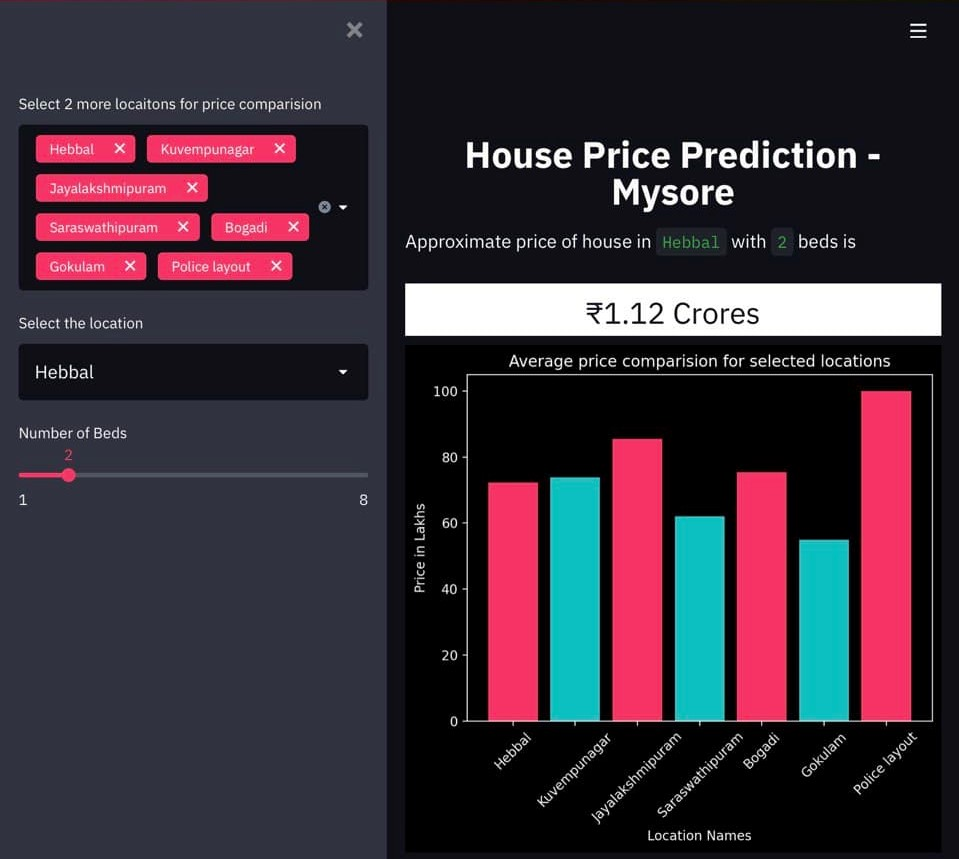

 # Mysore Real-Estate Analysis and House Price Prediction
The aim was to analyse the real estate market and predict the house prices in Mysore, Karnataka. A streamlit web-app is built for better visualization and prediction.

 

### Data Extraction
* The data is extracted from websites https://housing.com and https://99acres.com
* Only houses and apartment prices were considered leaving behind empty lands and commercial properties

### Data Cleaning
* The raw data is further cleaned resulting in five columns in the file `combined_cleaned.csv` are `Location`, `Beds`, `Price`, `Area`, `PricePerSqft`

### Model Building
* The data features were one-hot encoded for `location` and `Number of beds` and fed to the model.
* Linear Regression performed the worst as expected for a small dataset
* `gridsearchcv` was performed and was inferred that decision tree algorithm performed the best among `linear, lasso, decisionTree` algorithms. Later, `randomforestRegressor` was used to increase the accuracy.

### Deployment
Streamlit offers a great platform to host webapps easily. 

### REFERENCES
* https://www.geeksforgeeks.org/random-forest-regression-in-python/ 
* https://scikit-learn.org/stable/modules/generated/sklearn.ensemble.RandomForestRegressor.html 
* https://medium.com/analytics-vidhya/predicting-house-prices-using-classical-machine-learning-and-deep-learning-techniques-ad4e55945e2d 
* https://housing.com/ 
* https://99acres.com 
